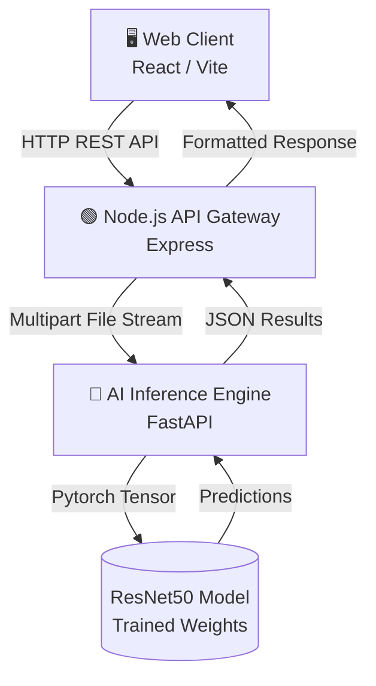

# OsteoGuard-AI

<div align="center">
  <p><strong>An Intelligent Clinical Support System for Bone Health Diagnostics</strong></p>

  [](https://reactjs.org/)
  [](https://nodejs.org/)
  [](https://fastapi.tiangolo.com/)
  [](https://pytorch.org/)
  [](https://tailwindcss.com/)
</div>

<br />

OsteoGuard-AI is a next-generation, highly-scalable, full-stack healthcare application designed to evaluate medical scans and autonomously diagnose bone density conditions. Leveraging a heavily fine-tuned **ResNet50 deep learning model**, the clinical AI pipeline swiftly classifies radiographic images into three distinct categories: **Normal**, **Osteopenia**, and **Osteoporosis**.

## 🏗 System Architecture

OsteoGuard uses a robust microservices architecture to enforce a strict separation of concerns. This provides extreme high availability for the user interface, while completely isolating heavy GPU/CPU tensor calculations to a dedicated, autoscaling inference server.



## ✨ Key Features

- **⚡ Blazing Fast AI Diagnostics**: Harnesses PyTorch and FastAPI to deliver completely asynchronous, sub-second inference pipelines.
- **🎨 Premium Dark UI**: Masterfully crafted interface using React 19, Tailwind CSS 4, and Framer Motion, matching modern high-end UX design (similar to Vercel/Linear).
- **🔒 Enterprise-Grade Security**: The API Gateway is heavily protected by `helmet`, strict `cors` policies, active rate limiters, and payload sanitizers to ensure patient data is never compromised.
- **📄 Instant PDF Reports**: Dynamic client-side generation of beautiful, shareable diagnostic reports using `jsPDF`.
- **📊 Real-time Data Visualization**: Integrated `recharts` for beautiful charts illustrating diagnostic certainty metrics and demographic analytics.

## 🛠 Tech Stack Details

| Domain | Technologies Used |
| :--- | :--- |
| **Frontend** | React 19, Vite, Tailwind CSS v4, Framer Motion, Lucide React, Recharts |
| **Backend** | Node.js, Express.js, Helmet, Express Rate Limit, Morgan, Winston, Multer |
| **AI Inference**| Python 3.13, FastAPI, Uvicorn, PyTorch, Torchvision, Pillow |

---

## 🚀 Local Deployment Guide

To spin up OsteoGuard-AI locally, you must boot up the AI microservice, the backend gateway, and the frontend client.

### Prerequisites
- **Node.js** (v18.0.0 or higher)
- **Python** (3.9.0 or higher)
- **npm** or **yarn**

### 1. Initialize the Python AI Service

The AI microservice performs the heavy tensor mathematics.

```bash
# Navigate to the AI service directory
cd ai_service

# Create an isolated python environment
python3 -m venv venv

# Activate the environment
source venv/bin/activate  # (On Windows: venv\Scripts\activate)

# Install the machine learning dependencies
pip install fastapi uvicorn torch torchvision pillow python-multipart

# Spin up the Uvicorn inference server
python main.py
```
*The AI inference engine will boot up on `http://localhost:8000`.*

### 2. Initialize the Node.js API Gateway

The backend acts as the secure intermediary, handling routing, middleware authentication, and serving files securely across origins.

```bash
# Open a new terminal tab, navigate to the backend
cd backend

# Install server dependencies
npm install

# Configure environment variables
cp .env.example .env

# Start the development server
npm run dev
```
*The API Gateway binds to `http://localhost:5000` by default.*

### 3. Initialize the React Frontend

Finally, boot up the client interface.

```bash
# Open a third terminal tab, navigate to the frontend
cd frontend

# Install UI dependencies
npm install

# Start the Vite development server
npm run dev
```
*The dynamic web interface will be available at `http://localhost:5173`.*

---

## 📂 Project Structure

```text
OsteoGuard-AI/
├── ai_service/                 # Fast API Python microservice for inference
│   ├── main.py                 # Uvicorn entry point
│   ├── best_model_finetuned.pth# PyTorch weights
│   └── venv/                   # Python environment
├── backend/                    # Node.js API Gateway
│   ├── src/                    # Controllers, routes, and middleware
│   ├── uploads/                # Temporary fast-storage for processing files
│   ├── package.json            
│   └── .env                    
├── frontend/                   # React 19 Client
│   ├── src/
│   │   ├── components/         # Reusable UI (Hero, Navbar, etc.)
│   │   ├── pages/              # Routing views (Upload, Dashboard, etc.)
│   │   ├── layouts/            # Page shell layouts
│   │   └── index.css           # Global Tailwind tokens
│   ├── package.json
│   └── vite.config.js
└── README.md                   # Project documentation
```

## 📜 Legal & Licensing

This project is designed for advanced research and educational demonstrations. Please note that this software has not been evaluated by the FDA or any medical authority. **Do not use for real clinical diagnosis** without proper clinical trials, regulatory clearance, and compliance integration.

---
<div align="center">
  <i>Conceptualized & Built for the future of radiology.</i>
</div>
